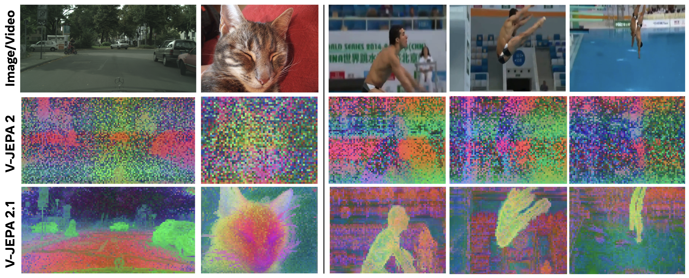
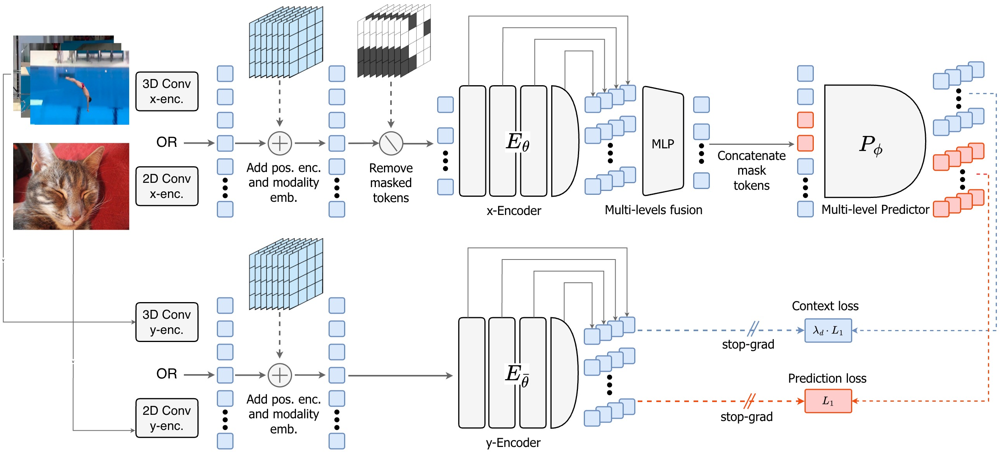

🆕 **[2026-03-16]:** :fire: V-JEPA 2.1 is released :fire: A new familly of models trained with a novel recipe that learns high quality and temporolly consistent dense features !!!

**[2025-06-25]:** V-JEPA 2 is released. [[`Blog`](https://ai.meta.com/blog/v-jepa-2-world-model-benchmarks)]


# V-JEPA 2: Self-Supervised Video Models Enable Understanding, Prediction and Planning

### [Meta FAIR](https://ai.meta.com/research/)

Mahmoud Assran∗, Adrien Bardes∗, David Fan∗, Quentin Garrido∗, Russell Howes∗, Mojtaba
Komeili∗, Matthew Muckley∗, Ammar Rizvi∗, Claire Roberts∗, Koustuv Sinha∗, Artem Zholus*,
Sergio Arnaud*, Abha Gejji*, Ada Martin*, Francois Robert Hogan*, Daniel Dugas*, Piotr
Bojanowski, Vasil Khalidov, Patrick Labatut, Francisco Massa, Marc Szafraniec, Kapil
Krishnakumar, Yong Li, Xiaodong Ma, Sarath Chandar, Franziska Meier*, Yann LeCun*, Michael
Rabbat*, Nicolas Ballas*

*Core Team

[[`Paper`](https://arxiv.org/abs/2506.09985)] [[`Blog`](https://ai.meta.com/blog/v-jepa-2-world-model-benchmarks)] [[`BibTex`](#Citation)]

Official Pytorch codebase for V-JEPA 2, V-JEPA 2-AC, V-JEPA 2.1.

V-JEPA 2 is a self-supervised approach to training video encoders, using internet-scale video data, that attains state-of-the-art performance on motion understanding and human action anticipation tasks. V-JEPA 2-AC is a latent action-conditioned world model post-trained from V-JEPA 2 (using a small amount of robot trajectory interaction data) that solves robot manipulation tasks without environment-specific data collection or task-specific training or calibration.

<p align="center">
	
</p>


## V-JEPA 2.1 Pre-training

Lorenzo Mur-Labadia, Matthew Muckley, Amir Bar, Mahmoud Assran, Koustuv Sinha, Michael
Rabbat, Yann LeCun, Nicolas Ballas, Adrien Bardes

[[`Paper`](https://arxiv.org/abs/TODO)] [[`BibTex`](#Citation)]

V-JEPA 2.1 improves the training recipe to focus on learning high-quality and temporally consistent dense features, as higlighted by PCA visualizations:

<p align="center">
	
</p>

The V-JEPA 2.1 approach leverages: (1) **Dense Predictive Loss**, a masking-based
self-supervision objective where all tokens (both visible/context and masked tokens) contribute to the
self-supervised training loss; (2) **Deep Self-Supervision**, which applies the self-supervised loss at multiple
intermediate representations of the encoder models; (3) **Multi-Modal Tokenizers** for images and videos;
and we show that our approach benefit from (4) **Model and data scaling**.

<p align="center">
	
</p>

V-JEPA 2.1 performance across dense and global prediction tasks:

<p align="center">
	
</p>


## V-JEPA 2 Pre-training

**(Top)** The encoder and predictor are pre-trained through self-supervised learning from video using a masked latent feature prediction objective, leveraging abundant natural videos to bootstrap physical world understanding and prediction. **(Bottom)** Performance of V-JEPA 2 on downstream understanding and prediction tasks.

&nbsp;
<table>
  <tr>
    <th colspan="1">Benchmark</th>
    <th colspan="1">V-JEPA 2</th>
    <th colspan="1">Previous Best</th>
  </tr>
  <tr>
    <td>EK100</td>
    <td>39.7%</td>
    <td>27.6% (PlausiVL)</td>
  </tr>
  <tr>
    <td>SSv2 (Probe)</td>
    <td>77.3%</td>
    <td>69.7% (InternVideo2-1B)</td>
  </tr>
  <tr>
    <td>Diving48 (Probe)</td>
    <td>90.2%</td>
    <td>86.4% (InternVideo2-1B)</td>
  </tr>
  <tr>
    <td>MVP (Video QA)</td>
    <td>44.5%</td>
    <td>39.9% (InternVL-2.5)</td>
  </tr>
  <tr>
    <td>TempCompass (Video QA)</td>
    <td>76.9%</td>
    <td>75.3% (Tarsier 2)</td>
  </tr>
</table>

## V-JEPA 2-AC Post-training

**(Top)** After post-training with a small amount of robot data, we can deploy the model on a robot arm in new environments, and tackle foundational tasks like reaching, grasping, and pick-and-place by planning from image goals. **(Bottom)** Performance on robot manipulation tasks using a Franka arm, with input provided through a monocular RGB camera.

&nbsp;
<table>
  <tr>
    <th colspan="1"></th>
    <th colspan="1"></th>
    <th colspan="2">Grasp</th>
    <th colspan="2">Pick-and-Place</th>
  </tr>
  <tr>
    <th colspan="1">Method</th>
    <th colspan="1">Reach</th>
    <th colspan="1">Cup</th>
    <th colspan="1">Box</th>
    <th colspan="1">Cup</th>
    <th colspan="1">Box</th>
  </tr>
  <tr>
    <td>Octo</td>
    <td>100%</td>
    <td>10%</td>
    <td>0%</td>
    <td>10%</td>
    <td>10%</td>
  </tr>
  <tr>
    <td>Cosmos</td>
    <td>80%</td>
    <td>0%</td>
    <td>20%</td>
    <td>0%</td>
    <td>0%</td>
  </tr>
  <tr>
    <td>VJEPA 2-AC</td>
    <td>100%</td>
    <td>60%</td>
    <td>20%</td>
    <td>80%</td>
    <td>50%</td>
  </tr>
</table>


## Models

### V-JEPA 2 and V-JEPA 2.1

#### HuggingFace

See our HuggingFace [collection](https://huggingface.co/collections/facebook/v-jepa-2-6841bad8413014e185b497a6) for V-JEPA 2.

#### V-JEPA 2 Pretrained Checkpoints

<table>
  <tr>
    <th colspan="1">Model</th>
    <th colspan="1">#Parameters</th>
    <th colspan="1">Resolution</th>
    <th colspan="1">Download Link</th>
    <th colspan="1">Pretraining Config</th>
  </tr>
  <tr>
    <td>ViT-L/16</td>
    <td>300M</td>
    <td>256</td>
    <td><a href="https://dl.fbaipublicfiles.com/vjepa2/vitl.pt">checkpoint</a></td>
    <td><a href="configs/train/vitl16">configs</a></td>
  </tr>
  <tr>
    <td>ViT-H/16</td>
    <td>600M</td>
    <td>256</td>
    <td><a href="https://dl.fbaipublicfiles.com/vjepa2/vith.pt">checkpoint</a></td>
    <td><a href="configs/train/vith16/">configs</a></td>
  </tr>
  <tr>
    <td>ViT-g/16</td>
    <td>1B</td>
    <td>256</td>
    <td><a href="https://dl.fbaipublicfiles.com/vjepa2/vitg.pt">checkpoint</a></td>
    <td><a href="configs/train/vitg16">configs</a></td>
  </tr>
  <tr>
    <td>ViT-g/16<sub>384</sub></td>
    <td>1B</td>
    <td>384</td>
    <td><a href="https://dl.fbaipublicfiles.com/vjepa2/vitg-384.pt">checkpoint</a></td>
    <td><a href="configs/train/vitg16">configs</a></td>
  </tr>
</table>

#### V-JEPA 2.1 Pretrained Checkpoints

<table>
  <tr>
    <th colspan="1">Model</th>
    <th colspan="1">#Parameters</th>
    <th colspan="1">Resolution</th>
    <th colspan="1">Download Link</th>
    <th colspan="1">Pretraining Config</th>
  </tr>

  <tr>
    <td>ViT-B/16</td>
    <td>80M</td>
    <td>384</td>
    <td><a href="https://dl.fbaipublicfiles.com/vjepa2/vjepa2_1_vitb_dist_vitG_384.pt">checkpoint</a></td>
    <td><a href="configs/train_2_1/vitb16">configs</a></td>
  </tr>

  <tr>
    <td>ViT-L/16</td>
    <td>300M</td>
    <td>384</td>
    <td><a href="https://dl.fbaipublicfiles.com/vjepa2/vjepa2_1_vitl_dist_vitG_384.pt">checkpoint</a></td>
    <td><a href="configs/train_2_1/vitl16">configs</a></td>
  </tr>

  <tr>
    <td>ViT-g/16</td>
    <td>1B</td>
    <td>384</td>
    <td><a href="https://dl.fbaipublicfiles.com/vjepa2/vjepa2_1_vitg_384.pt">checkpoint</a></td>
    <td><a href="configs/train_2_1/vitg16">configs</a></td>
  </tr>

  <tr>
    <td>ViT-G/16</td>
    <td>2B</td>
    <td>384</td>
    <td><a href="https://dl.fbaipublicfiles.com/vjepa2/vjepa2_1_vitG_384.pt">checkpoint</a></td>
    <td><a href="configs/train_2_1/vitG16">configs</a></td>
  </tr>
</table>


#### Pretrained backbones (via PyTorch Hub)

Please install [Pytorch](https://pytorch.org/get-started/locally/), [timm](https://pypi.org/project/timm/) and [einops](https://pypi.org/project/einops/) locally, then run the following to load each model. Installing Pytorch with CUDA support is strongly recommended.

```python
import torch

# preprocessor
processor = torch.hub.load('facebookresearch/vjepa2', 'vjepa2_preprocessor')
# models
# V-JEPA 2
vjepa2_vit_large = torch.hub.load('facebookresearch/vjepa2', 'vjepa2_vit_large')
vjepa2_vit_huge = torch.hub.load('facebookresearch/vjepa2', 'vjepa2_vit_huge')
vjepa2_vit_giant = torch.hub.load('facebookresearch/vjepa2', 'vjepa2_vit_giant')
vjepa2_vit_giant_384 = torch.hub.load('facebookresearch/vjepa2', 'vjepa2_vit_giant_384')
# V-JEPA 2.1
vjepa2_1_vit_base_384 = torch.hub.load('facebookresearch/vjepa2', 'vjepa2_1_vit_base_384')
vjepa2_1_vit_large_384 = torch.hub.load('facebookresearch/vjepa2', 'vjepa2_1_vit_large_384')
vjepa2_1_vit_giant_384 = torch.hub.load('facebookresearch/vjepa2', 'vjepa2_1_vit_giant_384')
vjepa2_1_vit_gigantic_384 = torch.hub.load('facebookresearch/vjepa2', 'vjepa2_1_vit_gigantic_384')

```

#### Pretrained checkpoints on Huggingface

You can also use our pretrained checkpoints on [Huggingface for V-JEPA 2](https://huggingface.co/collections/facebook/v-jepa-2-6841bad8413014e185b497a6).

```python
from transformers import AutoVideoProcessor, AutoModel

hf_repo = "facebook/vjepa2-vitg-fpc64-256"
# facebook/vjepa2-vitl-fpc64-256
# facebook/vjepa2-vith-fpc64-256
# facebook/vjepa2-vitg-fpc64-256
# facebook/vjepa2-vitg-fpc64-384

model = AutoModel.from_pretrained(hf_repo)
processor = AutoVideoProcessor.from_pretrained(hf_repo)
```

#### Evaluation Attentive Probes

We share the trained attentive probes for two of our visual understanding evals (Something-Something v2 and Diving48) and the action anticipation eval EPIC-KITCHENS-100.

<table>
  <tr>
    <th colspan="1">Model</th>
    <th colspan="4">SSv2</th>
    <th colspan="4">Diving48</th>
    <th colspan="4">EK100</th>
  </tr>
  <tr>
    <th colspan="1"></th>
    <th colspan="1">Checkpoint</th>
    <th colspan="1">Training Config</th>
    <th colspan="1">Inference Config</th>
    <th colspan="1">Result</th>
    <th colspan="1">Checkpoint</th>
    <th colspan="1">Training Config</th>
    <th colspan="1">Inference Config</th>
    <th colspan="1">Result</th>
    <th colspan="1">Checkpoint</th>
    <th colspan="1">Training Config</th>
    <th colspan="1">Inference Config</th>
    <th colspan="1">Result</th>
  </tr>
  <tr>
    <td>ViT-L/16</td>
    <td><a href="https://dl.fbaipublicfiles.com/vjepa2/evals/ssv2-vitl-16x2x3.pt">checkpoint</a></td>
    <td><a href="configs/eval/vitl/ssv2.yaml">config</a></td>
    <td><a href="configs/inference/vitl/ssv2.yaml">config</a></td>
    <td>73.7%</td>
    <td><a href="https://dl.fbaipublicfiles.com/vjepa2/evals/diving48-vitl-256.pt">checkpoint</a></td>
    <td><a href="configs/eval/vitl/diving48.yaml">config</a></td>
    <td><a href="configs/inference/vitl/diving48.yaml">config</a></td>
    <td>89.0%</td>
    <td><a href="https://dl.fbaipublicfiles.com/vjepa2/evals/ek100-vitl-256.pt">checkpoint</a></td>
    <td><a href="configs/eval/vitl/ek100.yaml">config</a></td>
    <td><a href="configs/inference/vitl/ek100.yaml">config</a></td>
    <td>32.7 R@5</td>
  </tr>
  <tr>
    <td>ViT-g/16<sub>384</td>
    <td><a href="https://dl.fbaipublicfiles.com/vjepa2/evals/ssv2-vitg-384-64x2x3.pt">checkpoint</a></td>
    <td><a href="configs/eval/vitg-384/ssv2.yaml">config</a></td>
    <td><a href="configs/inference/vitg-384/ssv2.yaml">config</a></td>
    <td>77.3%</td>
    <td><a href="https://dl.fbaipublicfiles.com/vjepa2/evals/diving48-vitg-384-32x4x3.pt">checkpoint</a></td>
    <td><a href="configs/eval/vitg-384/diving48.yaml">config</a></td>
    <td><a href="configs/inference/vitg-384/diving48.yaml">config</a></td>
    <td>90.2%</td>
    <td><a href="https://dl.fbaipublicfiles.com/vjepa2/evals/ek100-vitg-384.pt">checkpoint</a></td>
    <td><a href="configs/eval/vitg-384/ek100.yaml">config</a></td>
    <td><a href="configs/inference/vitg-384/ek100.yaml">config</a></td>
    <td>39.7 R@5</td>
  </tr>
</table>

### V-JEPA 2-AC

Our action-conditioned checkpoint was trained from the ViT-g encoder.
<table>
  <tr>
    <th colspan="1">Model</th>
    <th colspan="1">Download Link</th>
    <th colspan="1">Training Config</th>
  </tr>
  <tr>
    <td>ViT-g/16</td>
    <td><a href="https://dl.fbaipublicfiles.com/vjepa2/vjepa2-ac-vitg.pt">checkpoint</a></td>
    <td><a href="configs/train/vitg16/droid-256px-8f.yaml">config</a></td>
  </tr>
</table>

#### Pretrained action-conditioned backbone (via PyTorch Hub)

Please install [Pytorch](https://pytorch.org/get-started/locally/), [timm](https://pypi.org/project/timm/) and [einops](https://pypi.org/project/einops/) locally, then run the following to load each model. Installing Pytorch with CUDA support is strongly recommended.

```python
import torch

vjepa2_encoder, vjepa2_ac_predictor = torch.hub.load('facebookresearch/vjepa2', 'vjepa2_ac_vit_giant')
```


See [energy_landscape_example.ipynb](notebooks/energy_landscape_example.ipynb) for an example notebook computing the energy landscape of the pretrained action-conditioned backbone using a robot trajectory collected from our lab.
To run this notebook, you'll need to additionally install [Jupyter](https://jupyter.org/install) and [Scipy](https://scipy.org/install/) in your conda environment.


## Getting Started

### Setup

```
conda create -n vjepa2-312 python=3.12
conda activate vjepa2-312
pip install .  # or `pip install -e .` for development mode
```

**Note to macOS users:** V-JEPA 2 relies on [`decord`](https://github.com/dmlc/decord), which does not support macOS (and, unfortunately, is also no longer under development). In order to run the V-JEPA 2 code on macOS, you will need a different `decord` implementation. We do not make specific recommendations, although some users have reported the use of [`eva-decord`](https://github.com/georgia-tech-db/eva-decord) (see [PR 1](https://github.com/facebookresearch/vjepa2/pull/1)) or [`decord2`](https://github.com/johnnynunez/decord2) (see [PR 31](https://github.com/facebookresearch/vjepa2/pull/31)).  We leave the selection of the `decord` package up to the user's discretion.

### Usage Demo

See [vjepa2_demo.ipynb](notebooks/vjepa2_demo.ipynb) [(Colab Link)](https://colab.research.google.com/github/facebookresearch/vjepa2/blob/main/notebooks/vjepa2_demo.ipynb) or [vjepa2_demo.py](notebooks/vjepa2_demo.py) for an example of how to load both the HuggingFace and PyTorch V-JEPA 2 models and run inference on a sample video to get a sample classification result.

The script assumes the presence of downloaded model checkpoints so you will need to download the model weights and update the corresponding paths in the script. E.g.:
```
wget https://dl.fbaipublicfiles.com/vjepa2/vitg-384.pt -P YOUR_DIR
wget https://dl.fbaipublicfiles.com/vjepa2/evals/ssv2-vitg-384-64x2x3.pt -P YOUR_DIR

# Then update your model paths in vjepa2_demo.py.
pt_model_path = YOUR_DIR/vitg-384.pt
classifier_model_path = YOUR_DIR/ssv2-vitg-384-64x2x3.pt

# Then run the script (assumes your machine has a GPU)
python -m notebooks.vjepa2_demo
```

### Probe-based evaluation

Probe-based evaluation consists in training an attentive probe on top of frozen V-JEPA 2 features. We provide training scripts for training your own probes, and checkpoints to run inference directly.

#### Training probes

Evaluations can be run either locally, or distributed via SLURM. (Running locally is useful for debugging and validation).
These sample commands launch Something-Something v2 video classification; other evals are launched by specifying the corresponding config.
Use provided training configs under "Evaluation Attentive Probes". These configs allow to train multiple probes in parallel with various optimization parameters.
Change filepaths as needed (e.g. `folder`, `checkpoint`, `dataset_train`, `dataset_val`) to match locations of data and downloaded checkpoints on your local filesystem.
Change \# nodes and local batch size as needed to not exceed available GPU memory.

##### Local

To run locally, specify the GPUs to use on
```
python -m evals.main --fname configs/eval/vitl16/ssv2.yaml \
  --devices cuda:0 cuda:1
```

##### Distributed

```
python -m evals.main_distributed \
  --fname configs/eval/vitl/ssv2.yaml  \
  --time 8600 \
  --account my_account --qos=my_qos
```

#### Inference from existing probes

Use provided inference configs under [Evaluation Attentive Probes](#evaluation-attentive-probes).
Download the corresponding checkpoint, rename it to 'latest.pt', and create a folder with the checkpoint inside, with the format matching the variables in the config:
```
[folder]/[eval_name]/[tag]/latest.pt
```
Then run inference, locally or distributed, using the same evaluation commands as above, but with configs from `configs/inference`.

### Pretraining

Likewise, training can also be run locally or distributed. Pretraining and cooldown training phases are
run with the same command using different configs.
These sample commands launch initial training of a ViT-L model. Configs for cooldown (or action-conditioned) training
can be found in the same directory as the config for initial training.

#### Local

```
python -m app.main --fname configs/train/vitl16/pretrain-256px-16f.yaml \
  --devices cuda:0
```

#### Distributed

```
python -m app.main_distributed \
  --fname configs/train/vitl16/pretrain-256px-16f.yaml
  --time 6000
  --account my_account --qos=my_qos
```

### Postraining

Post-training of the action-conditioned model, starting from the pretrained VJEPA 2 backbone, also follows a similar interface, and can be run locally or distributed using [this config](configs/train/vitg16/droid-256px-8f.yaml).
We post-train the model starting from the ViT-g/16 backbone.

#### Local

```
python -m app.main --fname configs/train/vitg16/droid-256px-8f.yaml \
  --devices cuda:0
```

#### Distributed

```
python -m app.main_distributed \
  --fname configs/train/vitg16/droid-256px-8f.yaml
  --time 6000
  --account my_account --qos=my_qos
```

### Latent Variance Assessment for stack stability

This codebase includes an implementation of Latent Variance Assessment (LVA), a V-JEPA-2-based stack
stability method that learns action-conditioned latent dynamics and uses perturbation-induced
predictive variance as an instability score.

Prepare a `.pt` or `.npz` file with:
```
latents: [episodes, steps, dim] or [episodes, steps, tokens, dim]
actions: [episodes, steps - 1, action_dim]
stability: optional [episodes, steps] continuous labels in [0, 1]
collapse_step: optional [episodes], with -1 for never-collapsed episodes
```

If `stability` is omitted, labels are built from `collapse_step` using the discounted survival target in
the paper. To extract latents from saved frame trajectories with shape
`[episodes, steps, channels, frames, height, width]`, run:
```
python -m app.lva.extract_latents \
  --input stack_frames.pt \
  --output lva_latents.pt \
  --checkpoint /path/to/vjepa2.pt \
  --model-name vit_large \
  --use-sdpa --use-rope --uniform-power
```

Then train with:
```
python -m app.main --fname configs/train/lva/example.yaml --devices cuda:0
```

Run variance-based inference on a saved `z`/`action` sample:
```
python -m app.lva.inference --checkpoint /tmp/lva-example/latest.pt --sample sample.pt --threshold 0.5
```


## Code Structure

```
.
├── app                              # training loops
│   ├── vjepa                        #   V-JEPA 2 pre-training
│   ├── vjepa_2_1                    #   V-JEPA 2.1 pre-training
│   ├── vjepa_droid                  #   training the action-conditioned model
│   ├── lva                          #   Latent Variance Assessment for stack stability
│   ├── main_distributed.py          #   entrypoint for launch app on slurm cluster
│   └── main.py                      #   entrypoint for launch app locally on your machine
├── configs                          # config files with experiment params for training and evaluation
│   ├── train                        #   pretraining with V-JEPA 2 (phase 1), cooldown (phase 2), and action-conditioned training
│   ├── train_2_1                    #   pretraining with V-JEPA 2.1 (phase 1), cooldown (phase 2)
│   └── eval                         #   frozen evaluations
│   └── inference                    #   inference only frozen evaluations
├── evals                            # evaluation loops training an attentive probe with frozen backbone...
│   ├── action_anticipation_frozen   #   action anticipation
│   ├── image_classification_frozen  #   image understanding
│   ├── video_classification_frozen  #   video understanding
│   ├── main_distributed.py          #   entrypoint for distributed evaluations
│   └── main.py                      #   entrypoint for locally-run evaluations
├── src                              # the package
│   ├── datasets                     #   datasets, data loaders, ...
│   ├── models                       #   model definitions
│   ├── masks                        #   mask collators, masking utilities, ...
│   └── utils                        #   shared utilities
├── tests                            # unit tests for some modules in `src`

```

## License

The majority of V-JEPA 2 is licensed under MIT, however portions of the project are available under separate license terms:

[src/datasets/utils/video/randaugment.py](src/datasets/utils/video/randaugment.py)<br>
[src/datasets/utils/video/randerase.py](src/datasets/utils/video/randerase.py)<br>
[src/datasets/utils/worker_init_fn.py](src/datasets/utils/worker_init_fn.py)<br>

are licensed under the Apache 2.0 license.


## Citation
If you find this repository useful in your research, please consider giving a star :star: and cite the papers:

```bibtex
@article{assran2025vjepa2,
  title={V-JEPA~2: Self-Supervised Video Models Enable Understanding, Prediction and Planning},
  author={Assran, Mahmoud and Bardes, Adrien and Fan, David and Garrido, Quentin and Howes, Russell and
Komeili, Mojtaba and Muckley, Matthew and Rizvi, Ammar and Roberts, Claire and Sinha, Koustuv and Zholus, Artem and
Arnaud, Sergio and Gejji, Abha and Martin, Ada and Robert Hogan, Francois and Dugas, Daniel and
Bojanowski, Piotr and Khalidov, Vasil and Labatut, Patrick and Massa, Francisco and Szafraniec, Marc and
Krishnakumar, Kapil and Li, Yong and Ma, Xiaodong and Chandar, Sarath and Meier, Franziska and LeCun, Yann and
Rabbat, Michael and Ballas, Nicolas},
  journal={arXiv preprint arXiv:2506.09985},
  year={2025}
}
```

```bibtex
@article{murlabadia2026vjepa2_1,
  title={V-JEPA 2.1: Unlocking Dense Features in Video Self-Supervised Learning},
  author={Mur-Labadia, Lorenzo and Muckley, Matthew and Bar, Amir and Assran, Mahmoud and
Sinha, Koustuv and Rabbat, Michael and LeCun, Yann and Ballas, Nicolas and Bardes, Adrien},
  journal={arXiv preprint arXiv:2603.14482},
  year={2026}
}
```
